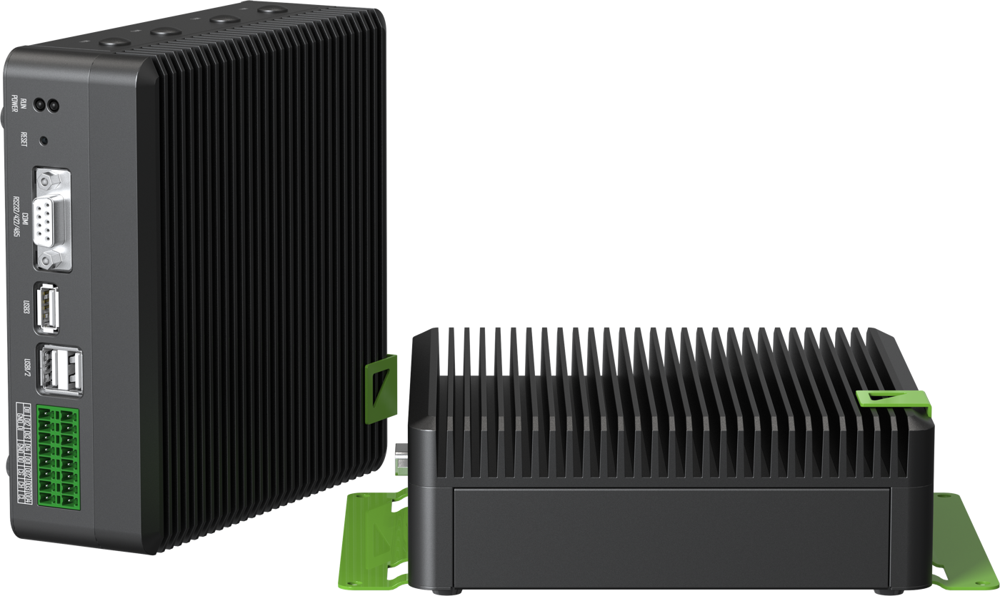
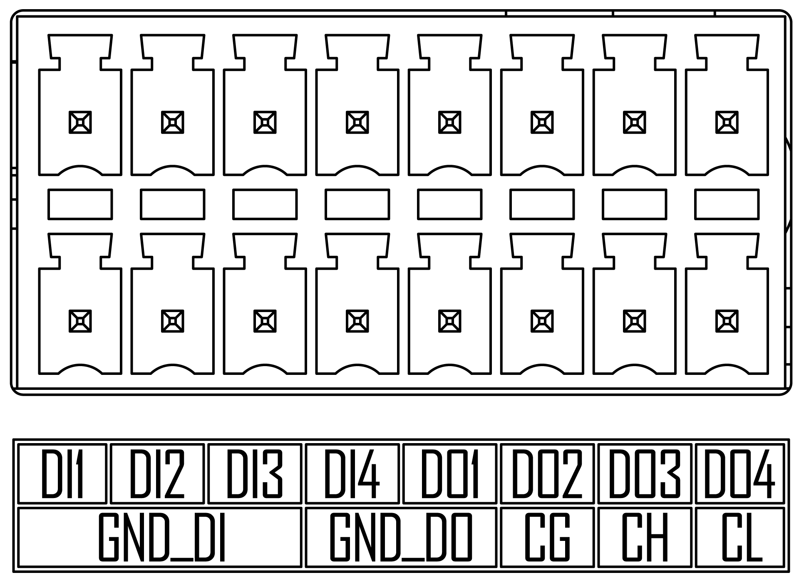
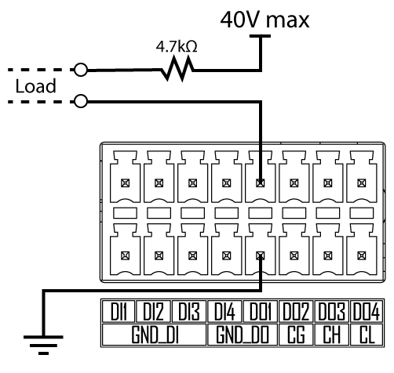

# seeedstudio — RocketWelder plugins for Seeed Jetson carriers

## GenericSeeedWelder — `ModelingEvolution.WeldingMachine.Seeed.Plugin`

A welding machine (e.g. a plasma cutter) whose **only control input is a start contact**, driven from one
isolated digital output of the station computer itself: a **Seeed reComputer Industrial J40/J30** or
**reServer Industrial J4012** on JetPack 6.

ArcOn = output ON, ArcOff = output OFF. No robot, network or controller sits between rw2 and the output —
the write is a local ioctl on `/dev/gpiochip0`, followed by a read-back.

### Configuration (rw2 → Devices → Add device → "Generic welder (Seeed digital output)")

| Property | Value |
|---|---|
| `SeeedDoOutput` | **1–4** = terminal **DO1–DO4**. Required, no default — read it off the cabinet wiring. |

### How to connect

**1. Find the terminal block.** The green 16-pin DI/DO/CAN block on the front panel, under the USB ports.
The reComputer Industrial and the reServer Industrial J4012 use the same block and the same pin-out.



**2. Pin-out.** Top row: DI1–DI4, DO1–DO4. Bottom row: GND_DI, GND_DO, then CAN (CG/CH/CL).



| Pin (Seeed numbering) | Label | Use here |
|---|---|---|
| 9 / 11 / 13 / 15 (top row, columns 5–8) | **DO1 / DO2 / DO3 / DO4** | the output — configure the same number in rw2 |
| 8 / 10 (bottom row, under DI4 and DO1) | **GND_DO** | 0 V of the external supply that powers the load |
| 1 / 3 / 5 / 7 | DI1–DI4 | not used by this plugin (12 V inputs) |
| 2 / 4 / 6 | GND_DI | not used |
| 12 / 14 / 16 | CG / CH / CL | CAN — not used |

**3. Wiring (Seeed's reference).** Each DO is an isolated, open-collector **sink**: the load sits between
the external +V (max 40 V) and DOx, and GND_DO goes to that supply's 0 V. Max **40 mA** per output.



**4. Wiring a plasma / welder start contact.** The output cannot switch the start circuit directly —
drive an **interface relay or SSR** and let its contact close the welder's start input (the contact a
Fairino control-box DO switches today).

```
   cabinet +24 V ──────────────┐
                               │
                        ┌──────┴──────┐  interface relay / SSR input
                        │  A1     (+) │  coil/input current ≤ 40 mA (aim < 20 mA)
                        │  A2     (−) │  flyback diode across the coil if the
                        └──────┬──────┘  relay module does not have one
                               │
   Seeed terminal  DO1 (pin 9) ┘
   Seeed terminal  GND_DO (pin 8 or 10) ──── cabinet 0 V (of the same 24 V supply)

   relay contact (COM / NO) ──── welder / plasma START input  (dry contact, as wired to the Fairino DO before)
   ideally in series with the E-stop / safety chain — see "Safe state" below
```

Configure **SeeedDoOutput = 1** for DO1 (2 for DO2, …). Check with a meter before the welder is connected:
with rw2 running the output is OFF; an ArcOn step closes the relay.

### Terminals → Jetson pins

Both carriers wire the DO terminals to the same pins (Seeed wiki, "Hardware and Interfaces Usage" for each
product). The plugin finds the line **by name**, so it does not depend on JetPack's GPIO numbering.

| Terminal | Line (BGA) | JetPack 6 | JetPack 5 sysfs |
|---|---|---|---|
| DO1 | `PI.00` | gpiochip0 51 | 399 |
| DO2 | `PI.01` | gpiochip0 52 | 400 |
| DO3 | `PI.02` | gpiochip0 53 | 401 |
| DO4 | `PH.07` | gpiochip0 50 | 398 |

### Wiring

Each DO is an optocoupled **sink**, **40 V / 40 mA max** per pin: load between +V and DOx, return on
**GND_DO** (pins 8/10). Seeed recommends a series resistor. 40 mA is a signal, not a contactor coil — use an
**interface relay or SSR with a low input current** (Fairino's control-box guide recommends < 20 mA for the
same job). Verify the relay's coil/input current on its datasheet.

### Safe state — what software can and cannot do

| Event | Output |
|---|---|
| Device attaches (boot, app start) | requested **LOW** |
| ArcOff, run STOP | **LOW**, confirmed by read-back, retried once |
| Device disposed | **LOW**, then released |
| SIGTERM / SIGHUP (`docker stop`, app restart) | **LOW** (signal hook) — measured on a reServer J4012 |
| **SIGKILL, crash, power loss of the Jetson only** | **UNCHANGED** — the kernel releases the line and leaves the pin as it was (measured) |

The last row is why the start contact should also go **through the E-stop / safety chain in hardware**.
A Fairino control-box DO differs here: the controller clears its own outputs on a stop.

### What the read-back proves

It reads the GPIO controller's **output register** — the SoC pin is driven. It does not see the
optocoupler, the terminal, the relay or an arc. Write + read-back takes < 1 ms.

### Host requirements

- rw2 with RocketWelder.SDK ≥ 2.18.0.
- The app container must see `/dev/gpiochip*` — the standard station compose runs `app` privileged, which
  is enough; otherwise add `devices: ["/dev/gpiochip0"]`.
- One device per terminal: a second device on the same DO fails with "already held".

### Install

Loopback-only on the station: `POST http://localhost/api/plugins/install` with
`{"packageId":"ModelingEvolution.WeldingMachine.Seeed.Plugin","version":"x.y.z"}`, then restart the app.

### Release

`./release.sh` cuts a `vX.Y.Z` tag; `.github/workflows/publish-nuget.yml` builds, tests and pushes to the
ModelingEvolution feed on a self-hosted runner. Never pack from a workstation.

### Bench probe

`src/SeeedDoProbe` drives the real welder code on a board:

```bash
dotnet publish src/SeeedDoProbe -c Release -r linux-arm64 --self-contained -p:PublishSingleFile=true -o out
scp out/SeeedDoProbe <board>:/tmp/
sudo /tmp/SeeedDoProbe cycle 1 300 3     # DO1 on/off 3x
sudo /tmp/SeeedDoProbe hold 1 on         # hold ON until SIGTERM
sudo cat /sys/kernel/debug/gpio | grep PI.00   # independent view: "rw2 DO1 ) out hi"
```

Do not run it while rw2 holds the same terminal — the request fails with "already held", by design.

---

Images in `docs/images/` are from the Seeed Studio wiki
([reComputer Industrial J40/J30 Hardware and Interfaces Usage](https://wiki.seeedstudio.com/reComputer_Industrial_J40_J30_Hardware_Interfaces_Usage/),
[reServer Industrial Hardware Interface Usage](https://wiki.seeedstudio.com/reserver_industrial_hardware_interface_usage/)), © Seeed Studio.
